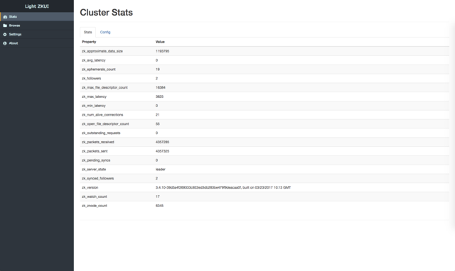

# Light Zookeeper UI (WARNING: Still in developing!!!)
a zookeeper webui implements with golang.

## Screenshot




## Docker

### Build Image

``` shell
$ make img=YOUR_IMAGE_NAME
```

### Run

``` shell
$ docker run -p 8080:8080 -e "ZK_URL=your-zk-1,your-zk-2,your-zk-3" jjeffcaii/light-zkui
```
